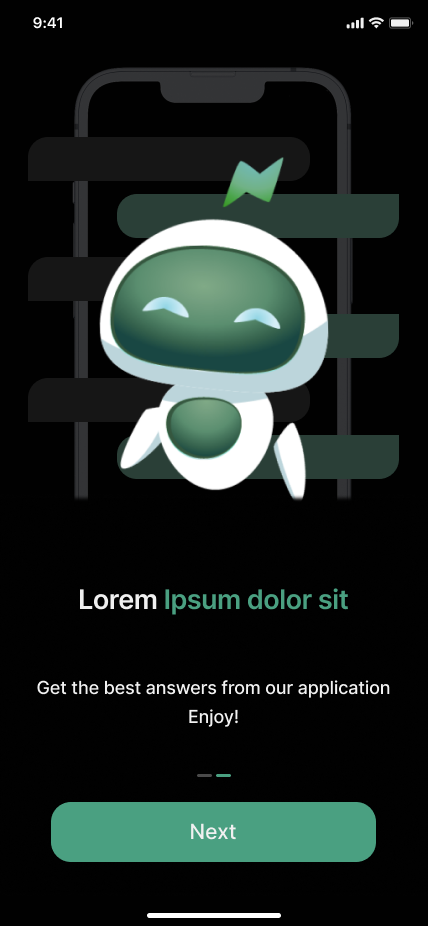
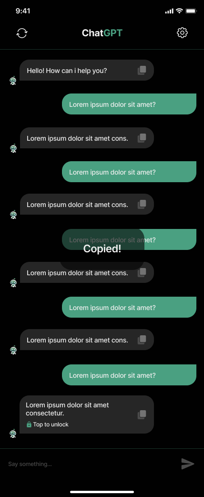

# Chat GPT Uygulaması 🤖 - TR

Mobil uygulama ile yapay zeka tabanlı sohbet deneyimini yaşayın! 📱

Chat GPT Uygulaması, OpenAI'nin GPT-3.5 tabanlı Chat API'sini kullanarak geliştirilen bir Flutter mobil uygulamasıdır. 🚀 Bu uygulama, kullanıcıların yapay zeka ile metin tabanlı sohbet etmelerini sağlar. Aynı zamanda hoş geldin ekranı, kullanım kılavuzu, ana sohbet ekranı, ayarlar ve WebView sayfaları içermektedir.

## Özellikler 🌟

🌟 **Hoş Geldin Ekranı**: Uygulama başladığında görsel olarak etkileyici bir hoş geldin ekranı ile kullanıcıları karşılar.

📖 **Karşılama Ekranı**: Kullanıcılara uygulamanın nasıl kullanılacağı hakkında detaylı bilgi sunan karşılama sayfası.

💬 **Sohbet Ekranı**: Kullanıcılar, OpenAI'nin GPT-3.5 tabanlı Chat API'si ile metin tabanlı olarak sohbet edebilirler.

⚙️ **Ayarlar**: Kullanıcıların tercihlerini yönetebilmeleri için tasarlanmış ayarlar sayfası.

🌐 **WebView Sayfaları**: Ayarlar sayfasında yer alan WebView bileşenleri ile farklı web içeriklerini görüntülemek mümkündür.

🔒 **Premium Üyelik**: Kullanıcılar premium üyelik satın aldığında sınırsız mesajlaşma hakkı kazanır ve sohbet sayfasını temizleyebilir.

## Ekran Görüntüleri 📸

  
  
  
  
  
  
  

## Kullanılan Paketler ve Teknolojiler 📦

Proje, aşağıdaki paketler ve teknolojiler ile geliştirilmiştir:

- `provider`: Uygulama içi durum yönetimi için kullanılmıştır. Widget ağacının alt bileşenlerine kolayca durum aktarımı sağlar.

- `lottie`: Animasyonları uygulamaya entegre etmek için kullanılmıştır. Görsel açıdan etkileyici animasyonlar eklemeyi kolaylaştırır.

- `http`: HTTP istekleri yapmak ve cevapları işlemek için kullanılmıştır. API istekleri ve yanıtlarını yönetir.

- `hive` ve `hive_flutter`: Hızlı ve hafif veritabanı yönetimi için kullanılmıştır. Yerel verileri saklamak ve yönetmek için kullanılır.

- `webview_flutter`: WebView bileşenini entegre etmek için kullanılmıştır. İçerisinde web sayfalarını görüntülemek için entegre bir tarayıcı sunar.

## Premium Üyelik 🔐

Kullanıcılar premium üyelik satın aldığında aşağıdaki avantajlara sahip olurlar:

- **Sınırsız Mesajlaşma**: Premium üyeler, metin tabanlı sohbetlerini sınırsız olarak gerçekleştirebilirler.

- **Sayfa Temizleme**: Premium üyeler, sohbet sayfasını hızla temizleyerek daha iyi bir görünüm elde edebilirler.

## Kurulum ⚙️

Projeyi yerel makinenize klonlamak ve çalıştırmak için aşağıdaki adımları izleyebilirsiniz:

1. Bu repo'yu forklayın veya doğrudan klonlayın: `git clone https://github.com/derinonursahin/chat_gpt.git`
   
2. Proje klasörüne gidin: `cd chat_gpt`
   
3. Gerekli bağımlılıkları yüklemek için: `flutter pub get`
   
4. Uygulamayı başlatmak için: `flutter run`

## Katkı Sağlama 👥

Eğer projeye katkıda bulunmak isterseniz, lütfen aşağıdaki adımları takip edin:

1. Bu repo'yu forklayın.

2. Yeni bir dal (branch) oluşturun: `git checkout -b yeni-ozellik`

3. Yaptığınız değişiklikleri commit'leyin: `git commit -am 'Yeni özellik: Açıklama'`

4. Dalınıza (branch) push yapın: `git push origin yeni-ozellik`

5. Bir Pull Talebi (Pull Request) oluşturun.

## Lisans 📜

Bu proje MIT Lisansı ile lisanslanmıştır. Daha fazla bilgi için `LICENSE` dosyasını inceleyebilirsiniz.

---

# Chat GPT Application 🤖 - EN

Experience artificial intelligence-based chat with a mobile app! 📱

Chat GPT Application is a Flutter mobile app developed using OpenAI's GPT-3.5-based Chat API. 🚀 This app enables users to engage in text-based conversations with an AI-powered chatbot. It also includes features such as a welcome screen, user guide, main chat screen, settings, and WebView pages.

## Features 🌟

🌟 **Welcome Screen**: Impressive visual welcome screen that greets users when the app starts.

📖 **Onboarding**: Detailed guide page providing information on how to use the application.

💬 **Chat Screen**: Users can engage in text-based conversations using OpenAI's GPT-3.5-based Chat API.

⚙️ **Settings**: Designed for users to manage their preferences.

🌐 **WebView Pages**: Users can view different web content using WebView components embedded within the settings page.

🔒 **Premium Membership**: Users gain unlimited messaging and the ability to clear the chat screen upon purchasing a premium membership.

## Screenshots 📸

  
  
  
  
  
  
  

## Used Packages and Technologies 📦

The project has been developed using the following packages and technologies:

- `provider`: Used for in-app state management. Facilitates easy state propagation down the widget tree.

- `lottie`: Employed to integrate animations into the application. Makes adding visually impressive animations easy.

- `http`: Utilized for making HTTP requests and processing responses. Manages API requests and responses.

- `hive` and `hive_flutter`: Employed for efficient and lightweight local database management. Used to store and manage local data.

- `webview_flutter`: Integrated to include the WebView component. Offers an embedded browser to view web pages.

## Premium Membership 🔐

Users who purchase a premium membership gain the following advantages:

- **Unlimited Messaging**: Premium members can engage in unlimited text-based conversations.

- **Chat Screen Clearing**: Premium members can quickly clear the chat screen for a cleaner interface.

## Installation ⚙️

To clone the project to your local machine and run it, follow these steps:

1. Fork this repo or clone it directly: `git clone https://github.com/derinonursahin/chat_gpt.git`

2. Navigate to the project directory: `cd chat_gpt`

3. Install the required dependencies: `flutter pub get`

4. To start the app: `flutter run`

## Contributing 👥

If you would like to contribute to the project, please follow these steps:

1. Fork this repo.

2. Create a new branch: `git checkout -b new-feature`

3. Commit your changes: `git commit -am 'New feature: Description'`

4. Push to your branch: `git push origin new-feature`

5. Create a Pull Request.

## License 📜

This project is licensed under the MIT License. For more information, refer to the `LICENSE` file.
