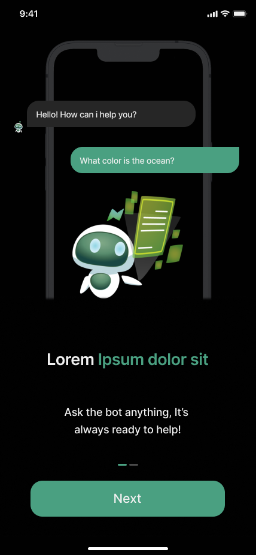
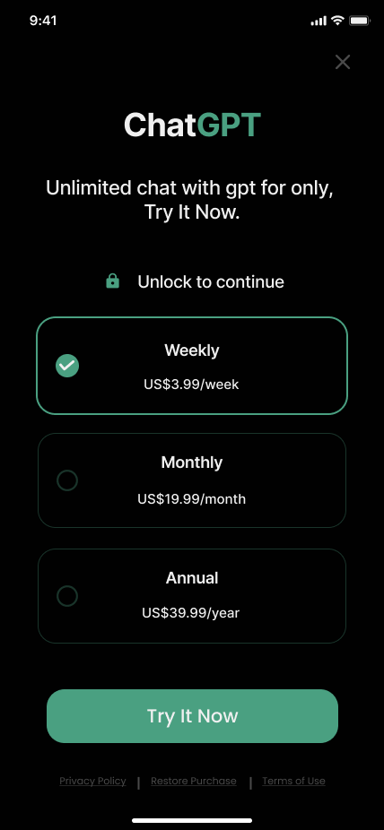
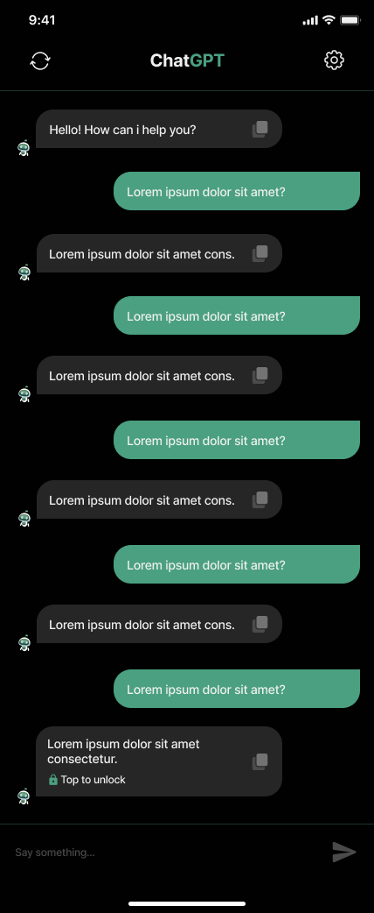

# Chat GPT Uygulaması 🤖

Mobil uygulama ile yapay zeka tabanlı sohbet deneyimini yaşayın! 📱

Chat GPT Uygulaması, OpenAI'nin GPT-3.5 tabanlı Chat API'sini kullanarak geliştirilen bir Flutter mobil uygulamasıdır. 🚀 Bu uygulama, kullanıcıların yapay zeka ile metin tabanlı sohbet etmelerini sağlar. Aynı zamanda hoş geldin ekranı, kullanım kılavuzu, ana sohbet ekranı, ayarlar ve WebView sayfaları içermektedir.

## Özellikler 🌟

🌟 **Hoş Geldin Ekranı**: Uygulama başladığında görsel olarak etkileyici bir hoş geldin ekranı ile kullanıcıları karşılar.

📖 **Kullanım Kılavuzu**: Kullanıcılara uygulamanın nasıl kullanılacağı hakkında detaylı bilgi sunan kılavuz sayfası.

💬 **Sohbet Ekranı**: Kullanıcılar, OpenAI'nin GPT-3.5 tabanlı Chat API'si ile metin tabanlı olarak sohbet edebilirler.

⚙️ **Ayarlar**: Kullanıcıların tercihlerini yönetebilmeleri için tasarlanmış ayarlar sayfası.

🌐 **WebView Sayfaları**: Ayarlar sayfasında yer alan WebView bileşenleri ile farklı web içeriklerini görüntülemek mümkündür.

🔒 **Premium Üyelik**: Kullanıcılar premium üyelik satın aldığında sınırsız mesajlaşma hakkı kazanır ve sohbet sayfasını temizleyebilir.

## Ekran Görüntüleri 📸

(screenshots/onboarding2_screen.png)

(screenshots/copy_screen.png)

## Kullanılan Paketler ve Teknolojiler 📦

Proje, aşağıdaki paketler ve teknolojiler ile geliştirilmiştir:

- `provider`: Uygulama içi durum yönetimi için kullanılmıştır. Widget ağacının alt bileşenlerine kolayca durum aktarımı sağlar.

- `lottie`: Animasyonları uygulamaya entegre etmek için kullanılmıştır. Görsel açıdan etkileyici animasyonlar eklemeyi kolaylaştırır.

- `http`: HTTP istekleri yapmak ve cevapları işlemek için kullanılmıştır. API istekleri ve yanıtlarını yönetir.

- `hive` ve `hive_flutter`: Hızlı ve hafif veritabanı yönetimi için kullanılmıştır. Yerel verileri saklamak ve yönetmek için kullanılır.

- `webview_flutter`: WebView bileşenini entegre etmek için kullanılmıştır. İçerisinde web sayfalarını görüntülemek için entegre bir tarayıcı sunar.

## Premium Üyelik 🔐

Kullanıcılar premium üyelik satın aldığında aşağıdaki avantajlara sahip olurlar:

- **Sınırsız Mesajlaşma**: Premium üyeler, metin tabanlı sohbetlerini sınırsız olarak gerçekleştirebilirler.

- **Sayfa Temizleme**: Premium üyeler, sohbet sayfasını hızla temizleyerek daha iyi bir görünüm elde edebilirler.

## Kurulum ⚙️

Projeyi yerel makinenize klonlamak ve çalıştırmak için aşağıdaki adımları izleyebilirsiniz:

1. Bu repo'yu forklayın veya doğrudan klonlayın: `git clone https://github.com/KULLANICI_ADI/chat_gpt.git`
   
2. Proje klasörüne gidin: `cd chat_gpt`
   
3. Gerekli bağımlılıkları yüklemek için: `flutter pub get`
   
4. Uygulamayı başlatmak için: `flutter run`

## Katkı Sağlama 👥

Eğer projeye katkıda bulunmak isterseniz, lütfen aşağıdaki adımları takip edin:

1. Bu repo'yu forklayın.

2. Yeni bir dal (branch) oluşturun: `git checkout -b yeni-ozellik`

3. Yaptığınız değişiklikleri commit'leyin: `git commit -am 'Yeni özellik: Açıklama'`

4. Dalınıza (branch) push yapın: `git push origin yeni-ozellik`

5. Bir Pull Talebi (Pull Request) oluşturun.

## Lisans 📜

Bu proje MIT Lisansı ile lisanslanmıştır. Daha fazla bilgi için `LICENSE` dosyasını inceleyebilirsiniz.

---

Bu README dosyası, Chat GPT Uygulaması'nın detaylarını ve kullanılan teknolojileri ayrıntılı bir şekilde açıklamaktadır. Herhangi bir konu hakkında daha fazla bilgi almak isterseniz, lütfen kodunuzu ve belgelerinizi inceleyin.
